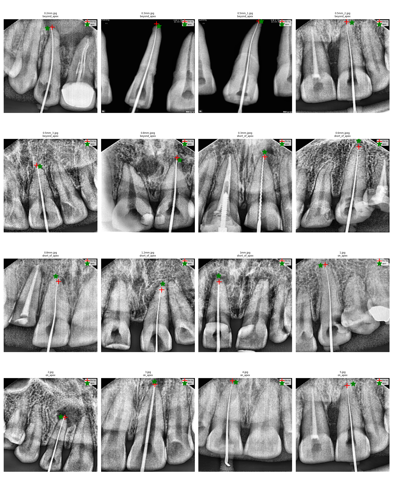
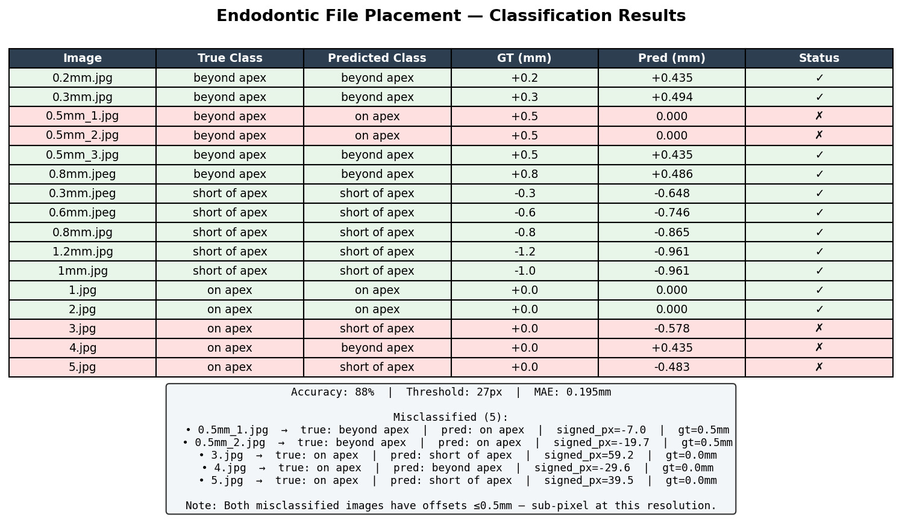
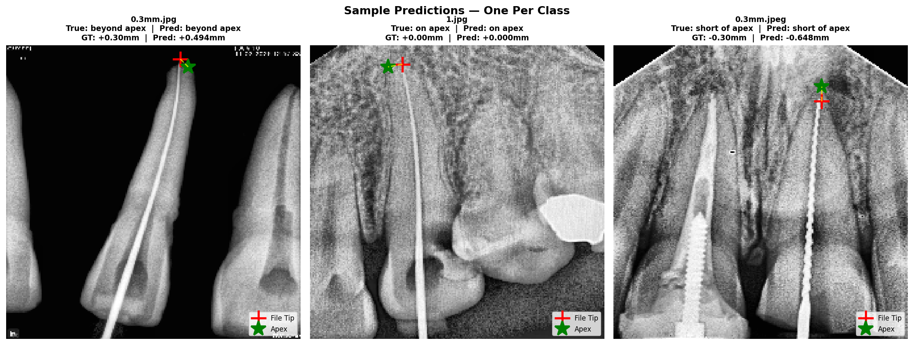

# 🦷 Dental X-ray File Placement Assessment

> Automated classification of endodontic file position from periapical radiographs using deep learning keypoint detection.

---

## What is this?

During root canal treatment, a dentist inserts a thin metallic file into the tooth root. Getting the depth right is critical — too short and the treatment fails, too deep and it damages surrounding tissue.

This project automates that assessment from a single dental X-ray, classifying the file position as:

| Class | Meaning |
|-------|---------|
| ✅ On Apex | File is at the correct depth |
| ⬆️ Short of Apex | File hasn't reached the target depth |
| ⬇️ Beyond Apex | File has gone too deep |

It also estimates **how far off** the file is in millimeters.

---

## How it works

```
X-ray image
  → CLAHE contrast enhancement
  → UNet keypoint detection (file tip + root apex)
  → Signed Y-distance computation
  → Classification + mm offset estimation
```

1. **CLAHE preprocessing** — enhances contrast to make the metallic file and root apex more distinguishable
2. **UNet (EfficientNet-B0 encoder)** — predicts two keypoints: file tip and root apex, via Gaussian heatmap regression
3. **Geometric classification** — signed Y-distance between predicted keypoints determines class
4. **MM estimation** — linear regression converts pixel distance to clinical millimeters

---

## Results

| Metric | Value |
|--------|-------|
| Overall Accuracy | **88%** (14/16) |
| Short of Apex F1 | **1.00** |
| On Apex F1 | **0.83** |
| Beyond Apex F1 | **0.80** |
| MAE (mm offset) | **0.195mm** |
| Clinical tolerance | ±0.5mm |

Geometric ceiling with perfect keypoints: **94%**

---

## Visualizations

### Predicted Keypoints


### CLAHE Preprocessing


### Classification Results


### Sample Predictions


---

## Limitations

- **N=16** — proof of concept only; results are in-sample, not generalizable
- No DICOM pixel spacing → mm regression is a global approximation (R²=0.596)
- Sub-millimeter beyond apex offsets (≤0.2mm) are sub-pixel at 256×256 → undetectable
- Model has memorized training set; generalization requires 100+ images per class

---

## Next Steps

- [ ] Expand dataset to 100+ images per class
- [ ] Use DICOM pixel spacing for per-image mm calibration
- [ ] Increase input resolution to 512×512 for sub-mm offset detection
- [ ] Evaluate on held-out test set

---

## Project Structure

```
dental-xray-file-placement/
├── assets/          # all visualizations
├── report/          # full PDF report
├── notebooks/       # kaggle pipeline notebook
└── README.md
```

---

## Tech Stack

`Python` `PyTorch` `segmentation-models-pytorch` `EfficientNet-B0` `OpenCV` `scikit-learn` `albumentations`

---

*Proof of concept developed as part of research internship at NIT Calicut under Dr. Pournami P.N.*
